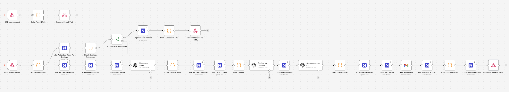

# Commercial Offer Assistant

Автоматизация подготовки коммерческих предложений для дилера техники на базе `n8n`, `NocoDB` и `OpenAI`.

Проект решает понятную бизнес-задачу: вместо ручной обработки заявок менеджер получает готовый черновик коммерческого предложения с подобранными позициями, структурированным текстом, ориентировочной стоимостью и следующим шагом для клиента.

## Почему это полезно

В типовом процессе менеджер:

- читает заявку клиента;
- определяет, что именно нужно: техника, запчасти или сервис;
- вручную ищет подходящие позиции;
- оценивает стоимость;
- собирает коммерческое предложение;
- фиксирует статус и историю обработки.

Этот workflow берёт на себя рутинную часть и сокращает путь от заявки до первого качественного черновика КП.

## Что умеет система

- принимает заявки через веб-форму;
- сохраняет их в `NocoDB`;
- определяет тип запроса и ключевые требования клиента;
- подбирает подходящие позиции из каталога;
- формирует HTML-черновик коммерческого предложения;
- сохраняет результат в таблицу заявок;
- отправляет менеджеру письмо на проверку;
- логирует каждый этап в `ActionLog`;
- защищает процесс от дублей заявок.

## Визуальный результат

### Форма заявки

### Заполнение формы

### Состояние во время отправки

### Уведомление об успешной отправке

### Защита от дублей

### Черновик коммерческого предложения

### Workflow в n8n

## Бизнес-кейс

Дилер техники получает разные типы обращений:

- подбор тракторов и другой техники;
- запросы на запчасти;
- сервисное обслуживание и ремонт.

Без автоматизации менеджер тратит время на одни и те же действия. В этом проекте заявка превращается в структурированный рабочий сценарий, где AI помогает с пониманием запроса и персонализацией текста, а `n8n` и `NocoDB` обеспечивают управляемый и прозрачный процесс.

## Как работает решение

1. Клиент открывает страницу `/new-request`.
2. Заполняет форму и отправляет заявку.
3. Workflow создаёт запись в `Requests` со статусом `new`.
4. OpenAI определяет тип запроса и выделяет требования.
5. Из `Catalog` выбираются доступные позиции по нужной категории.
6. AI формирует персонализированные блоки для коммерческого предложения:
   - `subject`
   - `greeting`
   - `need_summary`
   - `next_step`
   - `cta`
7. Нода `Build Offer Payload` собирает финальный HTML:
   - персонализированное обращение;
   - краткое понимание потребности клиента;
   - таблицу только с отобранными позициями;
   - причины выбора;
   - ориентировочную стоимость;
   - следующий шаг;
   - аккуратный деловой CTA.
8. Черновик записывается обратно в `Requests`, статус меняется на `draft_ready`.
9. Менеджеру отправляется письмо с готовым черновиком на проверку.
10. Все важные этапы фиксируются в `ActionLog`.

## Архитектура

### `n8n`

Оркестрация всего процесса:

- webhook-форма;
- маршрутизация сценария;
- вызовы `OpenAI`;
- работа с `NocoDB`;
- отправка уведомлений;
- управление статусами и ответами пользователю.

### `NocoDB`

Используется как простая и удобная база данных для:

- входящих заявок;
- каталога товаров и услуг;
- журнала действий.

### `OpenAI`

Используется в трёх ключевых задачах:

- классификация запроса;
- AI-подбор релевантных позиций из каталога;
- генерация персонализированных текстовых блоков для КП.

## Структура данных

### `Requests`

- `request_id`
- `client_name`
- `email`
- `request_text`
- `request_type`
- `manager_comment`
- `offer_text`
- `status`

### `Catalog`

- `item_id`
- `category`
- `name`
- `description`
- `price`
- `available`

### `ActionLog`

- `request_id`
- `action`
- `datetime`
- `result`

## Особенности реализации

- Современная HTML-форма с понятным пользовательским сценарием.
- Отдельная защита от повторной отправки одинаковых заявок.
- Логирование на каждом этапе процесса.
- AI не считает стоимость и не “фантазирует” каталог.
- Финальная структура КП собирается кодом, а не свободным текстом модели.
- Если для категории `техника` подобрано несколько альтернатив, стоимость выводится диапазоном `от ... до ...`, а не суммой всех вариантов.
- Если AI не вернул текстовые блоки, workflow использует fallback-значения и не ломает процесс.

## Технологический стек

- [n8n](https://n8n.io/)
- [NocoDB](https://www.nocodb.com/)
- [OpenAI](https://platform.openai.com/)

## Файлы проекта

- [README.md](/Users/apple/Codex/commercial_offer/README.md)
- [Практика. Commercial Offer Assistant with NocoDB + OpenAI3.json](</Users/apple/Codex/commercial_offer/Практика. Commercial Offer Assistant with NocoDB + OpenAI3.json>) — актуальная версия workflow
- [Практика. Commercial Offer Assistant with NocoDB + OpenAI2.json](</Users/apple/Codex/commercial_offer/Практика. Commercial Offer Assistant with NocoDB + OpenAI2.json>) — промежуточная версия
- [Практика. Commercial Offer Assistant with NocoDB + OpenAI-2.json](</Users/apple/Codex/commercial_offer/Практика. Commercial Offer Assistant with NocoDB + OpenAI-2.json>) — ранняя версия
- [n8n_commercial_offer_workflow.json](/Users/apple/Codex/commercial_offer/n8n_commercial_offer_workflow.json) — базовый экспорт
- `pic/` — скриншоты формы, подтверждений, защиты от дублей и workflow

## Как запустить

1. Создайте таблицы `Requests`, `Catalog` и `ActionLog` в `NocoDB`.
2. Импортируйте актуальный workflow в `n8n`.
3. Подключите credentials для:
   - `NocoDB`
   - `OpenAI`
   - SMTP / email node
4. Проверьте `workspace`, `project` и `table id` в нодах `NocoDB`.
5. Загрузите данные в `Catalog`.
6. Активируйте workflow.
7. Откройте webhook-страницу формы и отправьте тестовую заявку.

## Какой результат получает бизнес

- меньше ручной рутины у менеджера;
- быстрее подготовка первого черновика КП;
- единый стандарт обработки заявок;
- прозрачная история действий;
- более аккуратная и современная коммуникация с клиентом;
- готовая база для дальнейшего масштабирования процесса.

## Потенциал развития

- добавление авторизации менеджеров;
- отдельное хранение финальных КП и версий;
- расширенный подбор по бренду, мощности, бюджету и наличию;
- экспорт КП в PDF;
- интеграция с CRM;
- уведомления в Telegram, Slack или email-группы;
- аналитика по типам заявок, конверсии и SLA обработки.
